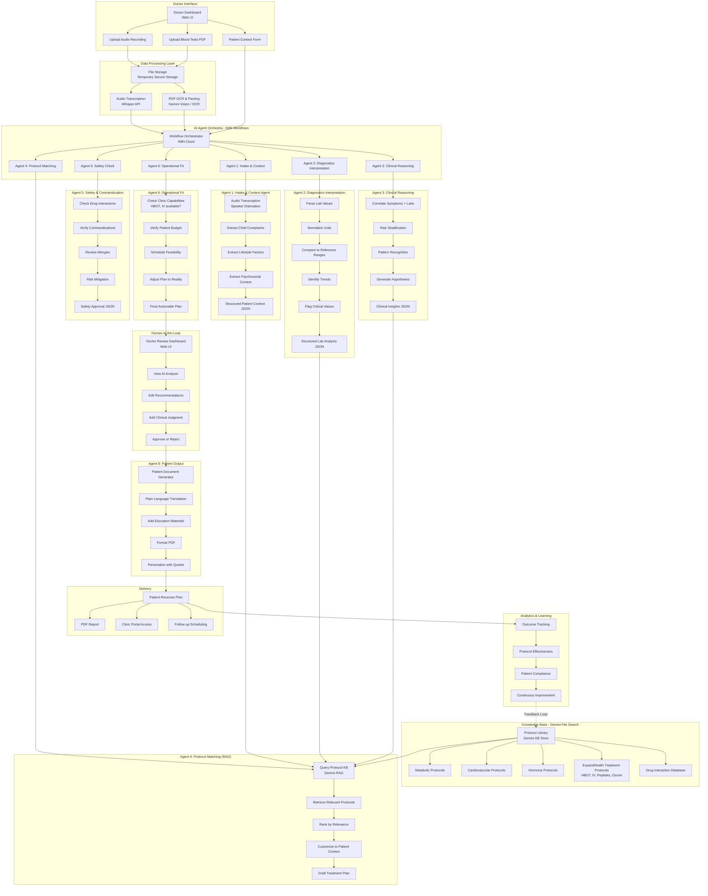
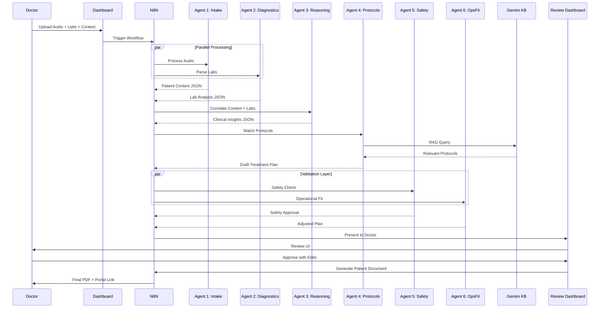
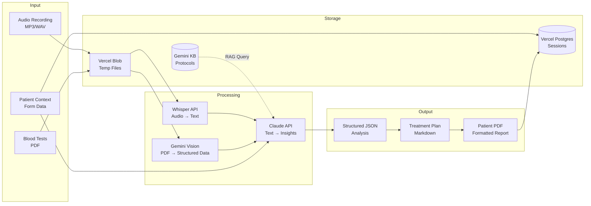
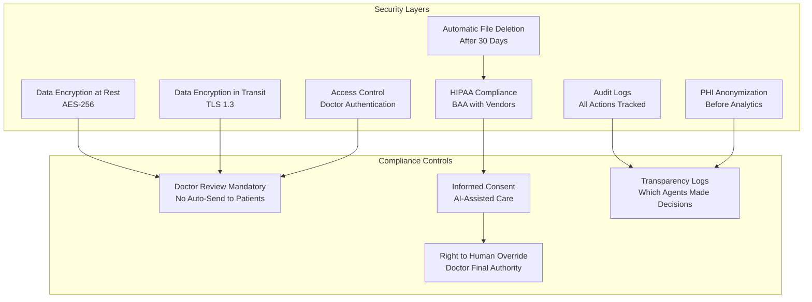
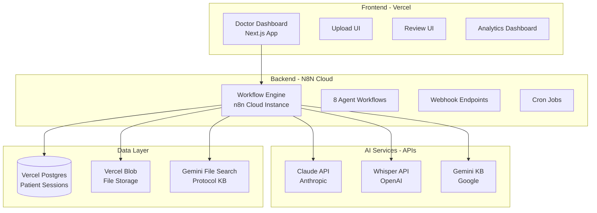
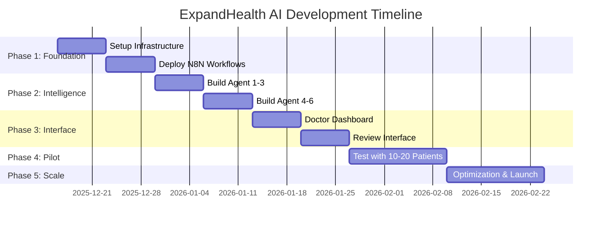
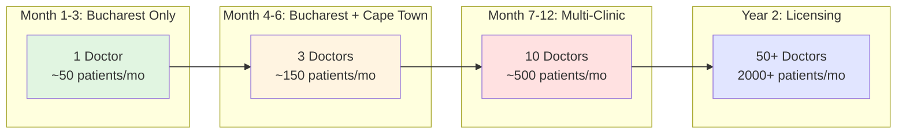

# ExpandHealth AI: System Architecture

**Version:** 2.0 (Agent-Based Architecture)
**Date:** December 12, 2025

---

## High-Level System Architecture



---

## Technology Stack

### Core Infrastructure

| Component | Technology | Cost | Purpose |
|-----------|-----------|------|---------|
| **Workflow Orchestration** | n8n Cloud (Starter) | $20/month | Coordinate all AI agents, workflows, webhooks |
| **AI Agent Engine** | Claude API (Sonnet 4.5) | Pay-per-use (~$50-150/month) | Power all 8 specialized agents |
| **Knowledge Base** | Google Gemini File Search | Free | Store and retrieve protocols via RAG |
| **Audio Transcription** | OpenAI Whisper API | Pay-per-use (~$0.006/min) | Convert doctor-patient audio to text |
| **OCR & Vision** | Gemini Vision API | Free tier / Pay-per-use | Parse blood test PDFs |
| **Web Dashboard** | Vercel + React/Next.js | Free tier | Doctor interface for upload + review |
| **File Storage** | Vercel Blob Storage | $0.15/GB | Temporary secure storage for uploads |
| **Database** | Vercel Postgres | $20/month | Store patient sessions, analytics |

**Total Monthly Cost (Phase 1):** ~$90-190/month

---

## Agent Communication Flow



---

## Data Flow Architecture



---

## Security & Compliance Architecture



---

## N8N Workflow Structure

```mermaid
graph LR
    subgraph "N8N Workflows"
        W1[1. Upload Handler Workflow]
        W2[2. Audio Processing Workflow]
        W3[3. Lab Analysis Workflow]
        W4[4. Clinical Reasoning Workflow]
        W5[5. Protocol Matching Workflow]
        W6[6. Safety Validation Workflow]
        W7[7. Review Dashboard API]
        W8[8. Patient Document Generator]
    end

    subgraph "Webhooks & Triggers"
        T1[/api/upload]
        T2[/api/process-audio]
        T3[/api/analyze-labs]
        T4[/api/clinical-reasoning]
        T5[/api/match-protocols]
        T6[/api/validate-safety]
        T7[/api/review]
        T8[/api/generate-pdf]
    end

    T1 --> W1
    T2 --> W2
    T3 --> W3
    T4 --> W4
    T5 --> W5
    T6 --> W6
    T7 --> W7
    T8 --> W8

    W1 -.triggers.-> W2
    W1 -.triggers.-> W3
    W2 -.sends data.-> W4
    W3 -.sends data.-> W4
    W4 -.sends data.-> W5
    W5 -.sends data.-> W6
    W6 -.sends data.-> W7
    W7 -.triggers.-> W8
```

---

## Deployment Architecture



---

## Development Phases (12 Weeks)



---

## Agent Architecture Deep Dive

### Agent 1: Intake & Context Agent

**Input:**
- Audio file (MP3/WAV)
- Patient demographics

**Processing:**
1. Call Whisper API for transcription
2. Call Claude API with specialized prompt:
   - Extract chief complaints
   - Extract lifestyle factors
   - Extract psychosocial context
   - Extract patient goals
   - Flag key quotes

**Output:**
```json
{
  "conversation_insights": {
    "chief_complaints": [...],
    "lifestyle": {...},
    "psychosocial": {...},
    "patient_goals": {...},
    "key_quotes": [...]
  }
}
```

**N8N Workflow:**
- Webhook trigger
- HTTP Request to Whisper API
- HTTP Request to Claude API
- JSON transformation
- Store in database

---

### Agent 4: Protocol Matching Agent (RAG)

**Input:**
- Patient context JSON (from Agent 1)
- Lab analysis JSON (from Agent 2)
- Clinical insights JSON (from Agent 3)

**Processing:**
1. Build RAG query from combined data
2. Query Gemini File Search KB
3. Retrieve top 5 relevant protocols
4. Call Claude API to synthesize:
   - Combine protocol recommendations
   - Customize to patient context
   - Add ExpandHealth clinic treatments
   - Format as treatment plan

**Output:**
```markdown
# Treatment Plan for John Doe

## Key Findings
- Metabolic syndrome pattern
- Cardiovascular risk factors
...

## Recommended Protocol
### Phase 1: Foundation (Weeks 1-4)
...
### Phase 2: Advanced Therapies (Weeks 5-8)
- HBOT: 20 sessions...
- IV NAD+: Weekly...
...
```

**N8N Workflow:**
- Webhook trigger with combined JSON
- HTTP Request to Gemini KB (RAG query)
- HTTP Request to Claude API (synthesis)
- Markdown formatting
- Store draft in database

---

## Cost Breakdown (Monthly)

| Service | Usage | Cost |
|---------|-------|------|
| N8N Cloud Starter | 1 instance | $20 |
| Claude API (Sonnet 4.5) | ~100 patients/mo @ ~$1 each | $100 |
| Whisper API | ~100 conversations @ 15 min avg | $9 |
| Gemini KB | Free tier (1M tokens/month) | $0 |
| Vercel Hosting | Pro plan | $20 |
| Vercel Postgres | 1GB | $20 |
| Vercel Blob Storage | 10GB | $1.50 |
| **Total** | | **~$170/month** |

**Cost per patient:** $1.70
**Revenue per patient (avg):** $500-2000
**Margin:** 99%+

---

## Scalability Plan



---

**This architecture is:**
- ✅ Low-cost ($170/month)
- ✅ Modular (8 independent agents)
- ✅ Scalable (cloud-native)
- ✅ Founder-built (MindValley AI course tools)
- ✅ Production-ready (proven tech stack)

**Built with MindValley AI Mastery course tools:**
- n8n workflows (Session 1-3)
- Claude API agents (Session 2-4)
- Gemini File Search KB (Session 1)
- Human-in-the-loop patterns (Session 3)
