# ExpandHealth AI: System Flowchart

**For: Jack Microfonder**
**From: Emilian**
**Date: December 12, 2025**

---

## Simple End-to-End Flow

```mermaid
graph TB
    START([Doctor with Patient])

    START --> A[Doctor records consultation<br/>+ uploads blood tests]

    A --> B{AI Processing<br/>8 Specialized Agents}

    B --> C[Audio → Clinical Context<br/>Symptoms, lifestyle, goals]
    B --> D[PDF → Lab Analysis<br/>Values, trends, red flags]

    C --> E[AI correlates everything<br/>+ queries protocol library]
    D --> E

    E --> F[Draft Treatment Plan<br/>Personalized + ExpandHealth protocols]

    F --> G[Doctor reviews plan<br/>Edits + Approves]

    G --> H[Patient receives<br/>customized plan]

    H --> END([Follow-up & Outcomes])

    style START fill:#e1f5e1
    style B fill:#fff4e1
    style G fill:#ffe1e1
    style END fill:#e1e5ff
```

**Time saved per patient:** 45 minutes → 15 minutes

---

## 8 AI Agents Architecture

**Each agent = Independent, modular, upgradeable**

---

## Technology Stack (MindValley AI Course Tools)

**Total monthly cost:** ~$170
**Cost per patient:** $1.70
**Built with MindValley course tools**

---

## Data Flow: Audio + Labs → Treatment Plan

```mermaid
flowchart LR
    A[🎙️ Audio Recording]
    B[📄 Blood Tests PDF]

    A --> C[Whisper API<br/>Speech → Text]
    B --> D[Gemini Vision<br/>PDF → Data]

    C --> E[Claude Agent 1<br/>Extract Context]
    D --> F[Claude Agent 2<br/>Analyze Labs]

    E --> G[Claude Agent 3<br/>Correlate Everything]
    F --> G

    KB[(Gemini KB<br/>ExpandHealth<br/>Protocols)]

    G --> H[Claude Agent 4<br/>RAG Query]
    KB --> H

    H --> I[Draft Plan]

    I --> J[Doctor Reviews<br/>& Edits]

    J --> K[📋 Patient PDF]

    style A fill:#e1f5e1
    style B fill:#e1f5e1
    style KB fill:#fff4e1
    style J fill:#ffe1e1
    style K fill:#e1e5ff
```

---

## Two Patient Flows (Bucharest + Cape Town Learning)

**Flow A:** Chronic disease, metabolic, longevity (60% of patients)
**Flow B:** Biohackers, prevention, wellness (40% of patients)

---

## Security & Compliance Layer

**Doctor has final authority on every plan**

---

## 12-Week Build Timeline

**Week 1-2:** Foundation (n8n, Claude API, Gemini KB setup)
**Week 3-4:** Intelligence Layer (8 agents)
**Week 5-6:** Interface (Doctor dashboard + review)
**Week 7-8:** Pilot (Real patients in Bucharest)
**Week 9-12:** Scale (Cape Town + optimization)

---

## Cost Breakdown

| Component | Monthly Cost | Purpose |
|-----------|--------------|---------|
| n8n Cloud | $20 | Workflow orchestration |
| Claude API | $100 | 8 AI agents (~100 patients) |
| Whisper API | $9 | Audio transcription |
| Gemini KB | $0 | Free tier (protocol library) |
| Vercel Hosting | $20 | Web dashboard |
| Database | $20 | Patient sessions |
| File Storage | $1.50 | Temporary uploads |
| **TOTAL** | **$170** | **~100 patients/month** |

**Per-patient cost:** $1.70
**Revenue per patient:** $500-2000
**Margin:** 99%+

---

## Scalability Roadmap

**Revenue trajectory:**
- Month 3: $25K MRR (50 patients × $500)
- Month 6: $75K MRR (150 patients × $500)
- Year 1: $250K MRR (500 patients × $500)
- Year 2: $1M+ MRR (licensing to other clinics)

---

## Why This Approach Works

✅ **Low-cost:** $170/month (not $50K+ for dev team)
✅ **Modular:** Each agent evolves independently
✅ **Founder-built:** I can build/maintain it myself
✅ **Validated tools:** MindValley AI course tech stack
✅ **Real clinic learning:** Built from our 2-year experience
✅ **Fast to market:** 12 weeks to pilot-ready
✅ **Clear validation gates:** Kill/iterate criteria at each phase

---

**Built with MindValley AI Mastery course tools:**
- n8n workflows
- Claude API agents
- Gemini File Search (knowledge base)
- Human-in-the-loop patterns

**This is not theory—it's the formalization of what we already do manually in Bucharest and Cape Town.**
